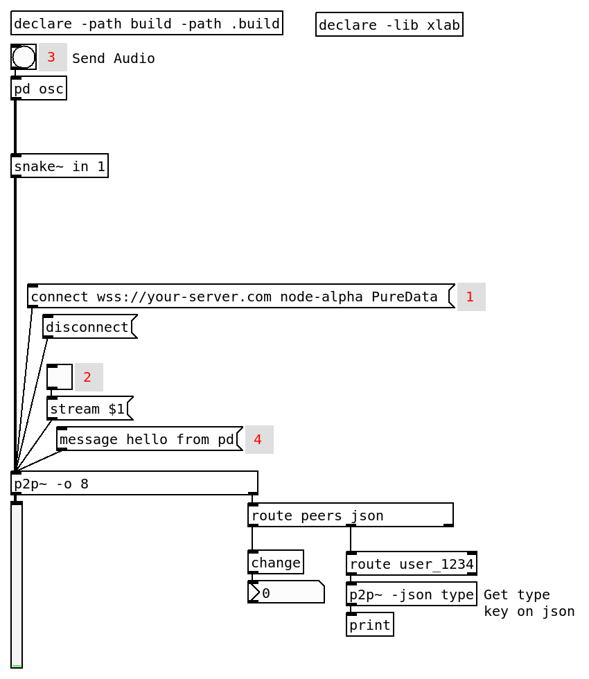

# p2p~

A Pure Data external for peer-to-peer audio streaming using WebRTC. 

## Basic Usage

## Server

You need to create your own server (cloudflare offers a free one) to run this. Check the `signaling-server` folder.

## Connection Flow

1. Create `[p2p~]`;
2. Send `connect URL room username`;
3. Turn on stream;
4. Output shows peer count via `peers` message.

## Outputs

- Left outlet: audio signals (multichannel)
- Right outlet: messages (`peers`, `json` data)

## Options

| Flag | Description |
|------|-------------|
| `-o N` | Multi-channel mode with N outputs |
| `-f` | Fixed channel mapping with `setchannel` |
| `-json key` | Parse incoming JSON messages |

## Messages

- `peers` - outlet reports number of connected peers
- `setchannel user channel` - assign user to output channel (-f mode only)
