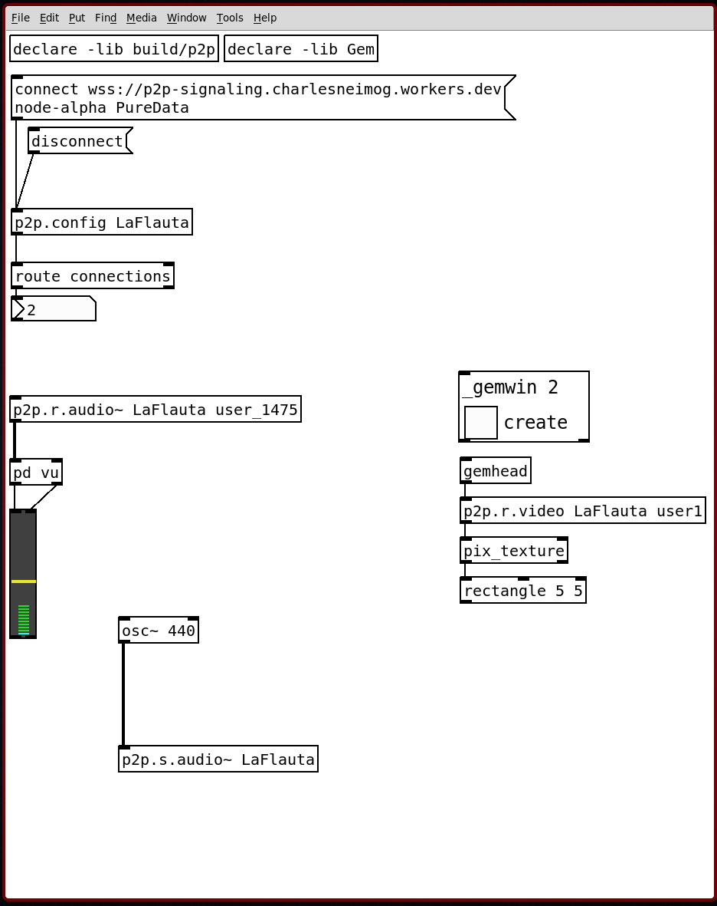
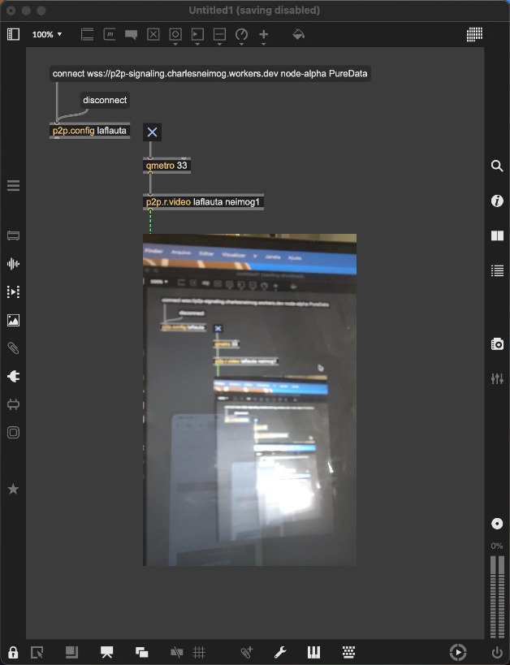

# p2p

`p2p` is a collection of Pure Data and Max/MSP externals for sending audio,
video, and messages directly between peers using WebRTC. A small signaling
server introduces users in the same room; media then travels peer to peer.

The collection provides:

- `p2p.config` — manages a named session and its connection
- `p2p.s.audio~` — sends an audio signal
- `p2p.r.audio~` — receives audio from a named user
- `p2p.r.video` — receives video through GEM (Pd) or Jitter (Max)

All objects belonging to one connection use the same session name as their
first argument.

## Testing

Use [https://charlesneimog.github.io/p2p/](https://charlesneimog.github.io/p2p/) to test the objects. Do not use this for your pieces, I can change this when I want! Check [`signaling-server`](signaling-server) directory to configure your server, it is easy and free!

## Compile

Requirements are CMake 3.30 or newer, a C/C++ compiler, Boost, and the Pure
Data development headers. Dependencies, including a static FFmpeg 7 build
with H.264 support, are downloaded automatically.

For Pure Data only:

```sh
cmake -S . -B build -DP2P_BUILD_MAX=OFF
cmake --build build --config Release
```

For Max/MSP only:

```sh
cmake -S . -B build-max -DP2P_BUILD_MAX=ON
cmake --build build-max --target p2p_max_package --config Release
```

If `MAX_SDK_PATH` is not set, CMake downloads Cycling '74's `max-sdk` v8.2.0.
The path may point to either a full `max-sdk` checkout or directly to its
`max-sdk-base` directory.
The Max externals are written to `build-max/p2p-max-package/externals`.

## Examples

### Pure Data



### Max/MSP



## Basic use

Create the objects with a shared session name, then send the following message
to `p2p.config`:

```text
connect wss://your-server.example room-name username
```

Use `stream 1` to start sending audio and `disconnect` to leave the room. See
[`p2p-help.pd`](p2p-help.pd) for a complete Pure Data patch.

## Signaling server

A signaling server is required to establish peer connections. The included
Cloudflare Workers implementation and deployment instructions are in the
[`signaling-server`](signaling-server) directory.
