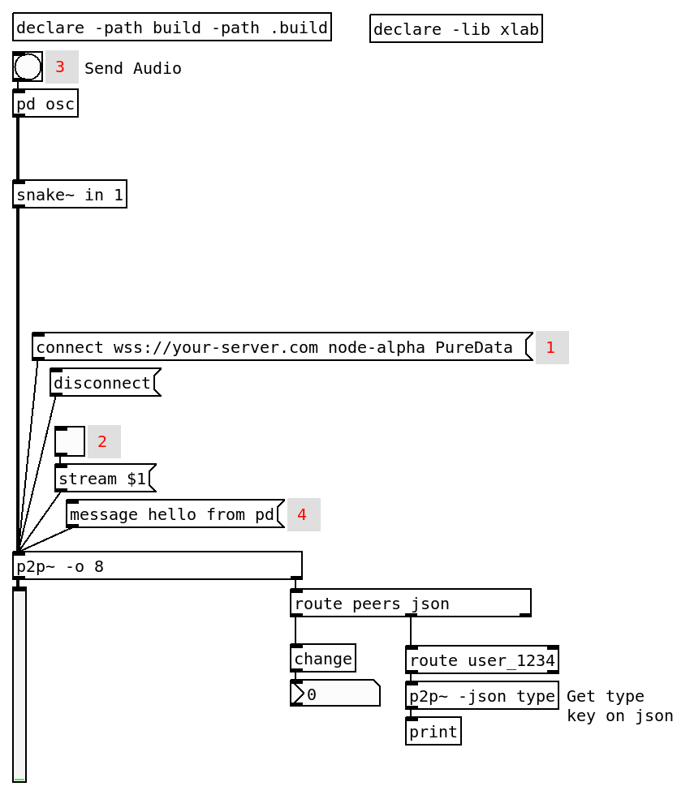

# p2p~

## Receiving video in GEM

When built with GEM and FFmpeg support, the Pure Data object accepts GEM's render list and
places the latest received WebRTC video frame on it. The receiver currently negotiates H.264.

```text
[gemhead]
|
[p2p~ -v]
|
[pix_texture]
|
[rectangle 5.33 3]
```

Video reception and its GEM outlet are created only when `[p2p~]` has the `-v` flag. GEM's
source is fetched automatically with CPM. CMake enables the feature when it also finds
the `libavcodec`, `libavutil`, and `libswscale` pkg-config modules. Load GEM before creating
`[p2p~]`, because the external uses GEM's `pixBlock` and `GemState` ABI. To build without the
video integration, configure with `-DP2P_GEM_VIDEO=OFF`.

A Pure Data external for peer-to-peer audio streaming using WebRTC. 

## Max/MSP and Jitter

The Max port follows the split-object API used by the current Pure Data version:

```text
[p2p.config session]
[p2p.s.audio~ session]
[p2p.r.audio~ session username]
[p2p.r.video session username]
```

Send `connect URL room username`, `stream 1`, `message ...`, `json ...`,
`report`, and `disconnect` to `p2p.config`. Bang `p2p.r.video` to output the
latest decoded frame as a named 4-plane `char` RGBA `jit_matrix`; connect it
directly to `jit.pwindow`, `jit.world`, or another Jitter object.

Create `[p2p.r.video session username]` before sending `connect` to
`[p2p.config session]`. Either object may be created first: the video receiver
registers the shared session immediately, so the later connection includes
recv-only H.264 in its initial WebRTC negotiation.

Configure the Max build with:

```sh
cmake -S . -B build-max -DP2P_BUILD_MAX=ON \
  -DP2P_GEM_VIDEO=OFF
cmake --build build-max --config Release
```

To build only the Max package, use
`cmake --build build-max --target p2p_max_package`.

When `MAX_SDK_PATH` is omitted, CMake fetches Cycling '74's official
`max-sdk-base` automatically. To use a local checkout instead, pass
`-DMAX_SDK_PATH=/path/to/max-sdk-base`.

The resulting self-contained externals are placed in
`build-max/p2p-max-package/externals`. The common P2P core is linked
statically into each external. The objects share sessions through a
process-wide registry anchored in Max itself, so no companion dylib is needed.

Use a fresh build directory when changing macOS architectures. On Apple
Silicon the default native `arm64` build is recommended. An Intel build needs
an `x86_64` OpenSSL toolchain as well; an ARM-only Homebrew OpenSSL from
`/opt/homebrew` cannot be linked into an Intel external.

## Basic Usage



## Server

You need to create your own server (cloudflare offers a free one) to run this. Check the `signaling-server` folder.

## Connection Flow

1. Create `[p2p~]`;
2. Send `connect URL room username`;
3. Turn on stream;
4. Output shows peer count via `peers` message.

## Outputs

- Left outlet: audio signals (multichannel)
- Right outlet: messages (`peers`, `json` data)

## Options

| Flag | Description |
|------|-------------|
| `-o N` | Multi-channel mode with N outputs |
| `-f` | Fixed channel mapping with `setchannel` |
| `-json key` | Parse incoming JSON messages |

## Messages

- `peers` - outlet reports number of connected peers
- `setchannel user channel` - assign user to output channel (-f mode only)
